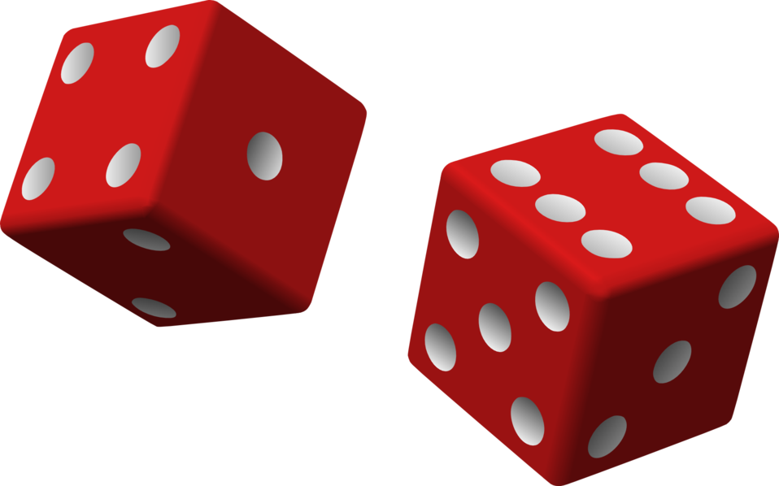

## If you roll a die 16 times, what is the probability that a 5 comes up 3 times?
```{r}
# my own attempt to create a function for this calculation
nx <- function(n, x) {
  nx <- (factorial(n)) / (factorial(x) * (factorial(n-x)))
  return(nx)
}

binomial_probability <- function(n, x, p) {
  prob <- nx(n, x) * (p^x) * ((1-p)^(n-x))
  return(prob)
}

dice <- binomial_probability(16, 3, (1/6))
dice
```
## Using R's built-in `dbinom()` function to achieve the same result 

```{r}
# using built-in R function to produce the same result
nums <- c(1:6)
 
prob <- dbinom(nums[3],16,1/6)
prob
```
[tutorialspoint](https://www.tutorialspoint.com/r/r_binomial_distribution.htm)
